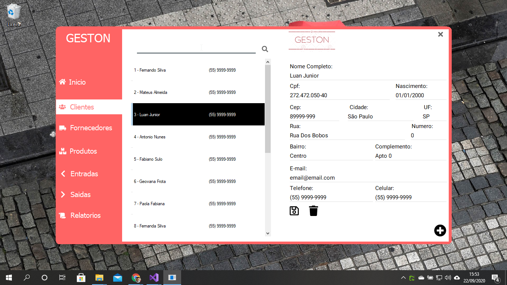

# GESTON - Gerenciamento de Estoque Naven
> Gerencie seu estoque com o GESTON!

Precisa de um simples controle de estoque?, use o GESTON, controle de clientes, fornecedores, entradas e saidas! 


## Instalação

```sh
Execulte o Geston.exe

```

## Desenvolvimento

```sh
Abra o projeto no Visual Studio
Load Dependencies
```

## Usage: 
    C# Lambda
    C# Linq
    C# Generics
    C# Reflection
    Dapper
    Dapper.Contrib
    SQLite

## Release History

* 0.0.1
    * EM DESENVOLVIMENTO

## Meta

Zanchet Luan – [@zanchetluan](https://twitter.com/zanchetluan) – luuanzanchet@outlook.com


[https://github.com/LuanZanchet/Geston](https://github.com/LuanZanchet)

## Contributing

1. Fork it (<https://github.com/LuanZanchet/Geston/fork>)
2. Create your feature branch (`git checkout -b feature/fooBar`)
3. Commit your changes (`git commit -am 'Add some fooBar'`)
4. Push to the branch (`git push origin feature/fooBar`)
5. Create a new Pull Request

<!-- Markdown link & img dfn's -->
[npm-image]: https://img.shields.io/npm/v/datadog-metrics.svg?style=flat-square
[npm-url]: https://npmjs.org/package/datadog-metrics
[npm-downloads]: https://img.shields.io/npm/dm/datadog-metrics.svg?style=flat-square
[travis-image]: https://img.shields.io/travis/dbader/node-datadog-metrics/master.svg?style=flat-square
[travis-url]: https://travis-ci.org/dbader/node-datadog-metrics
[wiki]: https://github.com/yourname/yourproject/wiki
